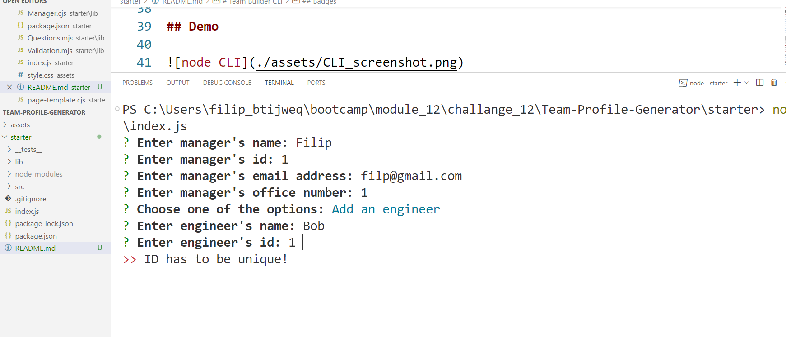
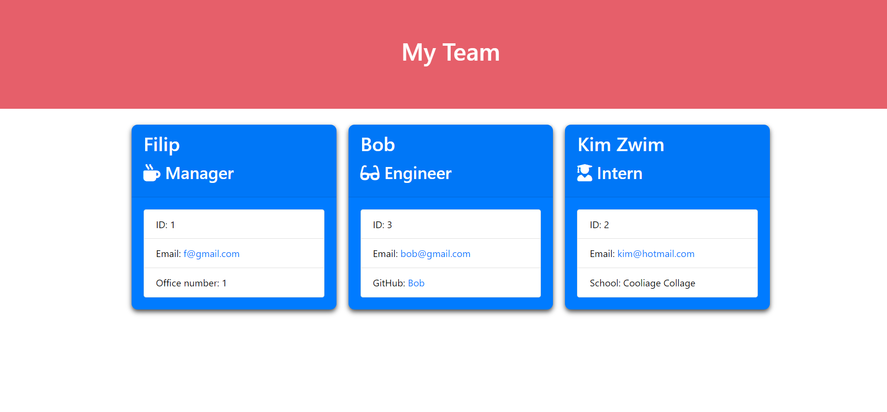

# Team Builder CLI

## Description

Team Builder CLI is a command-line interface (CLI) application that helps you build a development team by gathering information about team members and generating an HTML file to display their information.

## Table of Contents 

- [Badges](#badges)

- [Demo](#demo)

- [Features](#features)

- [Installation](#installation)

- [Usage](#usage)

- [Project Structure](#project-structure)

- [License](#license)

- [Contributing](#contributing)

- [Tests](#tests)

- [Questions](#questions)


## Badges


## Demo





## Features

- Add a manager, engineer, or intern to the team.

- Collect information such as name, ID, email, and specific details like GitHub username for engineers and school for interns.

- Validate user input to ensure data integrity.

- Generate an HTML file to display the team members' information.

## Installation

There is no specific installation required for this application.

+ In command shell or terminal navigate to the directory where you want 

to clone the repository.

```
cd /path/to/your/directory
```

+ Clone the repository.

```
git clone https://github.com/FilipKotanski/team-builder-cli.git
```

+ Initialise a new Node.js project with default values for package.json.

```
npm init -y
```

+ Install dependencies  and save them to package.json file.

```
npm install --save axios inquirer email-validator
```

+ Run index.js in Node.js server-side environment.

```
node index.js
```

## Usage

+ Build professional team.html file in minutes by following the prompts 

  to add team members.

+ Choose "Finish building the team" when done.

+ The team.html file will save automatically in the output directory.

+ Open file in a code editor of your choice and customise to your needs.

## Project Structure

+ `__tests_` Contains all tests for required project classes

+ `lib` Contains classes for different team members, question arrays for 

  inquirer prompts and validation functions for validating user input.

+ `src` Contains the page template for generating the HTML file.

+ `index.js` Main entry point of the application.

+ `package.json` Configuration file for npm packages and scripts.

+ `README.md` Project documentation.

## Dependencies

+ __inquirer__: For collecting user input.

+ __axios__: For making HTTP requests.

+ __email-validator__: For validating email addresses.

## License

This project is licensed under the MIT License - see the [LICENSE](https:opensource.org/licenses/MIT) file for details.

## Contributing

All contributions are welcome. For major changes, please open an issue first to 

discuss what you would like to change.

### How to Contribute

1. Fork the project.

2. Create a new branch for your contribution (`git checkout -b feature/my-feature`).

3. Make your changes and commit them (`git commit -m 'Add feature'`).

4. Push to the branch (`git push origin feature/my-feature`).

5. Open a pull request.

### Branching Strategy

- `master`: Main development branch.

- `release`: Stable releases.

- `feature/`: Feature branches.

### Pull Request Process

+ Open a pull request with a clear title and description.

+ Ensure all tests pass.

+ Await code review and address feedback if necessary.

+ Once approved, the pull request will be merged.

### Issues and Labels

+ Use the "bug" label for bug reports.

+ Use the "enhancement" label for feature requests.

## Tests

To ensure your changes don't introduce new issues, run the tests using `npm test`.
    
## Questions

[](https://twitter.com/Filip_Kotanski)

  [](https://www.linkedin.com/in/filip-kotanski-9275252a5/)

  [](https://github.com/FilipKotanski)

For questions and bugs reporting get in touch via email at [filip.kotanski@gmail.com](mailto:filip.kotanski@gmail.com "Feel free to reach out!").
